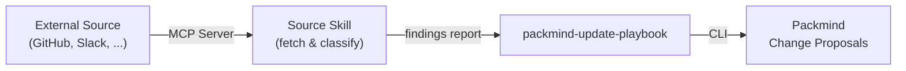

# Packmind Playbook Updates from External Sources

Demonstrate how to automatically update your [Packmind](https://github.com/PackmindHub/packmind/) playbook by mining external data sources — using Agent Skills and MCP servers within Claude Code.

## Architecture

Each use case follows the same pattern:

1. A **source skill** fetches data via an **MCP server** and classifies it for playbook relevance
2. The classified findings are handed off to **packmind-update-playbook**, which creates change proposals in Packmind

## Use Cases

| Use Case | Source | Mode | Link |
|----------|--------|------|------|
| [GitHub PR Comments](./update-from-github-pr-comments/) | Merged PR review comments | Interactive + CI (GitHub Actions) | [README](./update-from-github-pr-comments/README.md) |
| [Slack Conversations](./update-from-slack/) | Slack channel discussions | Interactive | [README](./update-from-slack/README.md) |

## Extensibility

The same pattern works with any data source that has an MCP server — Jira, Confluence, Notion, Linear, and more. To add a new source:

1. Create a source skill that fetches and classifies data via the relevant MCP server
2. Output a structured findings report
3. Hand off to `packmind-update-playbook`

## Prerequisites

- A [Packmind](https://docs.packmind.com) account and organization
- `PACKMIND_API_KEY_V3` environment variable set
- [Packmind CLI](https://docs.packmind.com/getting-started/gs-cli-setup) installed: `npm install -g @packmind/cli`
- [Claude Code](https://docs.anthropic.com/en/docs/claude-code) installed

## Links

- [Packmind](https://github.com/PackmindHub/packmind/)
- [Packmind Documentation](https://docs.packmind.com)
- [Packmind CLI Setup](https://docs.packmind.com/getting-started/gs-cli-setup)
