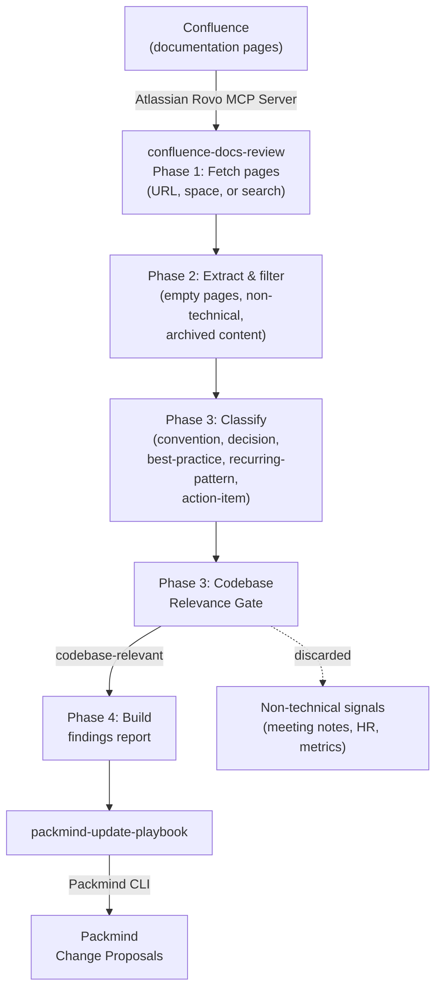

# Update Playbook from Confluence Documentation

Browse Confluence documentation for coding conventions, architectural decisions, best practices, and technical knowledge, then automatically create Packmind change proposals. Includes a codebase relevance gate that filters out non-technical content (meeting notes, HR policies, project metrics, etc.) to keep findings focused on what matters for code.

Supports both interactive usage via any AI coding agent with MCP support (Claude Code, GitHub Copilot, Cursor, etc.) and automated CI runs via `CI=true` or `--non-interactive`.

## How It Works



## Skills

| Skill | Description |
|-------|-------------|
| `confluence-docs-review` | Browses Confluence pages via Atlassian MCP, filters noise, classifies by playbook relevance, applies a codebase relevance gate, and produces a structured findings report |
| `packmind-update-playbook` | Reads the findings report and creates/updates Packmind playbook artifacts (standards, commands, skills) |
| `packmind-cli-list-commands` | Reference for Packmind CLI listing commands — used to discover existing artifacts before creating duplicates |

## Setup

### 1. Install Packmind CLI

```bash
npm install -g @packmind/cli
```

### 2. Configure Atlassian Rovo MCP Server

Add the [Atlassian Rovo MCP server](https://developer.atlassian.com/cloud/mcp/) to your AI coding agent's MCP configuration. The Rovo MCP server provides Confluence tools prefixed with `mcp__confluence__` (e.g., `search`, `getConfluencePage`, `getConfluenceSpaces`). See the [Getting Started with the Atlassian Remote MCP Server](https://support.atlassian.com/atlassian-rovo-mcp-server/docs/getting-started-with-the-atlassian-remote-mcp-server/) guide for full setup instructions and authentication details.

### 3. Deploy Skills

Copy the skills from this demo into your target repository:

```bash
cp -r update-from-confluence/skills/confluence-docs-review <your-repo>/.claude/skills/
cp -r update-from-confluence/skills/packmind-update-playbook <your-repo>/.claude/skills/
cp -r update-from-confluence/skills/packmind-cli-list-commands <your-repo>/.claude/skills/
```

### 4. Authentication

| Secret / Variable | Where | Purpose |
|-------------------|-------|---------|
| `PACKMIND_API_KEY_V3` | Environment variable | Packmind API authentication |
| Atlassian Rovo auth | MCP server config | Atlassian MCP server access (see [Atlassian MCP docs](https://support.atlassian.com/atlassian-rovo-mcp-server/docs/getting-started-with-the-atlassian-remote-mcp-server/)) |
| `ANTHROPIC_API_KEY` | CI environment | Claude API access (CI only) |

## Interactive Usage

Start your AI coding agent in the repository and invoke the skill. Example with Claude Code:

```
claude
> /confluence-docs-review
```

The skill will ask how you want to browse Confluence:
- **Page URL**: analyze a specific Confluence page
- **Space**: browse pages within a Confluence space
- **Search keywords**: find relevant pages by topic

After analysis, findings are saved to `.claude/tmp/confluence-review-findings.md` and you're asked whether to proceed with playbook updates.

## Non-Interactive Usage

```bash
# Search by query
claude --skill confluence-docs-review --non-interactive --query "coding standards"

# Fetch a specific page
claude --skill confluence-docs-review --non-interactive --url "https://mysite.atlassian.net/wiki/spaces/ENG/pages/123456789"

# Browse a space
claude --skill confluence-docs-review --non-interactive --space ENG
```

At least one of `--url`, `--space`, or `--query` is required in non-interactive mode. If none are provided, the skill exits gracefully.

## Codebase Relevance Gate

Confluence documentation often contains non-technical content alongside coding knowledge. The `confluence-docs-review` skill applies a **codebase relevance gate** after classification:

> **Litmus test**: "Would an AI coding agent need to know this when writing, reviewing, or shipping code in this repository?"

| Signal | Verdict | Why |
|--------|---------|-----|
| "All API endpoints must validate input with Zod" | KEEP | Coding convention |
| "Use feature flags for gradual rollouts" | KEEP | Architecture pattern |
| "Error handling: always wrap async calls in try-catch" | KEEP | Best practice |
| "Git branching strategy: trunk-based development" | KEEP | Dev workflow |
| "Team OKRs for Q1 2026" | DISCARD | Business metrics |
| "How to request PTO" | DISCARD | HR process |
| "Confluence space organization guide" | DISCARD | Tooling documentation |
| "Sprint planning process" | DISCARD | Project management |

Discarded signals are listed in a transparency section at the end of the findings report.

## Output

| Mode | Report path |
|------|-------------|
| Interactive | `.claude/tmp/confluence-review-findings.md` |
| CI | `.claude/reports/confluence-review-findings-YYYY-MM-DD.md` |

## Links

- [Packmind](https://github.com/PackmindHub/packmind/)
- [Packmind Documentation](https://docs.packmind.com)
- [Packmind CLI Setup](https://docs.packmind.com/getting-started/gs-cli-setup)
- [Atlassian Rovo MCP Server](https://support.atlassian.com/atlassian-rovo-mcp-server/docs/getting-started-with-the-atlassian-remote-mcp-server/)
