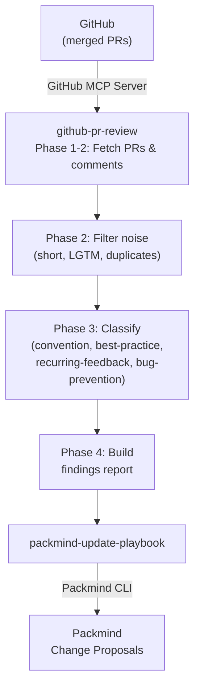

# Update Playbook from GitHub PR Comments

Mine review comments from merged pull requests, classify them for playbook relevance (conventions, best practices, recurring feedback, bug prevention patterns), and automatically create Packmind change proposals.

Supports both interactive usage via any AI coding agent with MCP support (Claude Code, GitHub Copilot, Cursor, etc.) and automated CI runs via GitHub Actions.

## How It Works



## Skills

| Skill | Description |
|-------|-------------|
| `github-pr-review` | Fetches merged PR review comments via GitHub MCP, filters noise, classifies by playbook relevance, and produces a structured findings report |
| `packmind-update-playbook` | Reads the findings report and creates/updates Packmind playbook artifacts (standards, commands, skills) |
| `packmind-cli-list-commands` | Reference for Packmind CLI listing commands — used to discover existing artifacts before creating duplicates |

## Setup

### 1. Install Packmind CLI

```bash
npm install -g @packmind/cli
```

### 2. Configure GitHub MCP Server

Add the [GitHub MCP server](https://github.com/github/github-mcp-server) to your AI coding agent's MCP configuration (e.g. `.claude/mcp.json` for Claude Code). See the [GitHub MCP server documentation](https://github.com/github/github-mcp-server) for full setup instructions.

```json
{
  "mcpServers": {
    "github": {
      "type": "http",
      "url": "https://api.githubcopilot.com/mcp",
      "headers": {
        "Authorization": "Bearer <GITHUB_PERSONAL_ACCESS_TOKEN>"
      }
    }
  }
}
```

### 3. Deploy Skills

Copy the skills from this demo into your target repository:

```bash
cp -r update-from-github-pr-comments/skills/github-pr-review <your-repo>/.claude/skills/
cp -r update-from-github-pr-comments/skills/packmind-update-playbook <your-repo>/.claude/skills/
cp -r update-from-github-pr-comments/skills/packmind-cli-list-commands <your-repo>/.claude/skills/
```

### 4. Authentication

| Secret / Variable | Where | Purpose |
|-------------------|-------|---------|
| `PACKMIND_API_KEY_V3` | Environment variable | Packmind API authentication |
| `GITHUB_PERSONAL_ACCESS_TOKEN` | MCP config | GitHub MCP server access |
| `ANTHROPIC_API_KEY` | GitHub Actions secret | Claude API access (CI only) |
| `API_GH_TOKEN` | GitHub Actions secret | GitHub API access for checkout and MCP (CI only) |

## Interactive Usage

Start your AI coding agent in the repository and invoke the skill. Example with Claude Code:

```
claude
> /github-pr-review
```

The skill will prompt you for:
- **Repository**: inferred from `git remote`, or specify manually
- **Time period**: how far back to look (default: 7 days, max: 90 days)

After analysis, findings are saved to `.claude/tmp/pr-review-findings.md` and you're asked whether to proceed with playbook updates.

## CI Mode (GitHub Actions)

The included workflow (`update-from-github-pr-comments/.github/workflows/weekly-pr-review.yml`) runs the skill automatically. Copy it to your repository's `.github/workflows/` directory.

### Schedule

Runs every **Monday at 9:00 UTC** via cron, or on manual dispatch.

### Manual Dispatch Inputs

| Input | Default | Description |
|-------|---------|-------------|
| `days` | `90` (dispatch) / `7` (scheduled) | Number of days to look back |
| `repo` | _(inferred from git remote)_ | `owner/repo` override |
| `model` | `claude-sonnet-4-6` | Claude model to use |

### Required Secrets

Configure these in your repository's Settings > Secrets and variables > Actions:

- `ANTHROPIC_API_KEY` — Claude API key
- `API_GH_TOKEN` — GitHub personal access token (needs `repo` and `read:org` scopes)
- `PACKMIND_API_KEY_V3` — Packmind API key

### Artifacts

Reports are uploaded as workflow artifacts (`pr-review-reports`) with 30-day retention, and displayed in the GitHub Actions job summary.

## Output

| Mode | Report path |
|------|-------------|
| Interactive | `.claude/tmp/pr-review-findings.md` |
| CI | `.claude/reports/pr-review-findings-YYYY-MM-DD.md` |

## Links

- [Packmind](https://github.com/PackmindHub/packmind/)
- [Packmind Documentation](https://docs.packmind.com)
- [Packmind CLI Setup](https://docs.packmind.com/getting-started/gs-cli-setup)
- [GitHub MCP Server](https://github.com/github/github-mcp-server)
