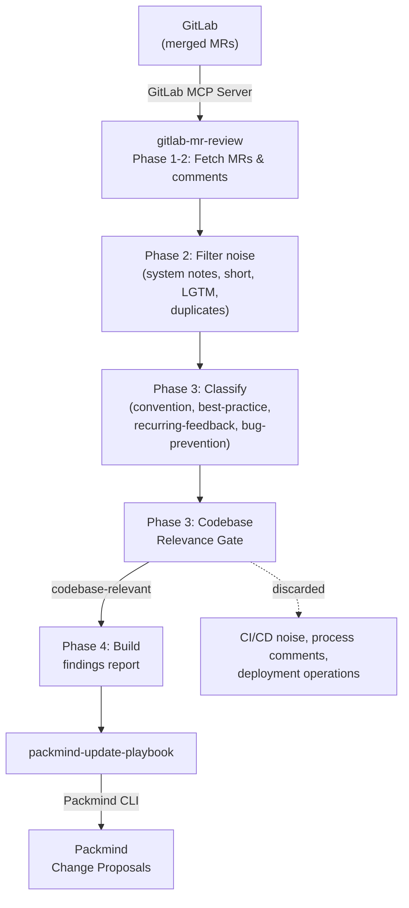

# Update Playbook from GitLab MR Comments

Mine review comments from merged GitLab merge requests, classify them for playbook relevance (conventions, best practices, recurring feedback, bug prevention patterns), and automatically create Packmind change proposals. Includes a codebase relevance gate that filters out CI/CD noise and process comments to keep findings focused on what matters for code.

Supports both interactive usage via any AI coding agent with MCP support (Claude Code, GitHub Copilot, Cursor, etc.) and automated CI runs via `CI=true` or `--non-interactive`.

## How It Works



## Skills

| Skill | Description |
|-------|-------------|
| `gitlab-mr-review` | Fetches merged MR review comments via GitLab MCP, filters noise (system notes, short comments), classifies by playbook relevance, applies a codebase relevance gate, and produces a structured findings report |
| `packmind-update-playbook` | Reads the findings report and creates/updates Packmind playbook artifacts (standards, commands, skills) |
| `packmind-cli-list-commands` | Reference for Packmind CLI listing commands — used to discover existing artifacts before creating duplicates |

## Setup

### 1. Install Packmind CLI

```bash
npm install -g @packmind/cli
```

### 2. Configure GitLab MCP Server

Add the [GitLab MCP server](https://docs.gitlab.com/user/gitlab_duo/model_context_protocol/mcp_server/) to your AI coding agent's MCP configuration (e.g. `.claude/mcp.json` for Claude Code). See the [GitLab MCP server documentation](https://docs.gitlab.com/user/gitlab_duo/model_context_protocol/mcp_server/) for full setup instructions.

```json
{
  "mcpServers": {
    "gitlab": {
      "type": "http",
      "url": "https://gitlab.com/api/mcp",
      "headers": {
        "Authorization": "Bearer <GITLAB_PERSONAL_ACCESS_TOKEN>"
      }
    }
  }
}
```

### 3. Deploy Skills

Copy the skills from this demo into your target repository:

```bash
cp -r update-from-gitlab-mr-comments/skills/gitlab-mr-review <your-repo>/.claude/skills/
cp -r update-from-gitlab-mr-comments/skills/packmind-update-playbook <your-repo>/.claude/skills/
cp -r update-from-gitlab-mr-comments/skills/packmind-cli-list-commands <your-repo>/.claude/skills/
```

### 4. Authentication

| Secret / Variable | Where | Purpose |
|-------------------|-------|---------|
| `PACKMIND_API_KEY_V3` | Environment variable | Packmind API authentication |
| GitLab MCP auth | MCP server config | GitLab MCP server access (OAuth or PAT — see [GitLab MCP docs](https://docs.gitlab.com/user/gitlab_duo/model_context_protocol/mcp_server/)) |
| `ANTHROPIC_API_KEY` | CI environment | Claude API access (CI only) |

## Interactive Usage

Start your AI coding agent in the repository and invoke the skill. Example with Claude Code:

```
claude
> /gitlab-mr-review
```

The skill will prompt you for:
- **Project**: inferred from `git remote`, or specify manually
- **Time period**: how far back to look (default: 7 days, max: 90 days)

After analysis, findings are saved to `.claude/tmp/gitlab-mr-review-findings.md` and you're asked whether to proceed with playbook updates.

## Codebase Relevance Gate

Unlike GitHub PR comments which are mostly code-focused, GitLab MR notes can include CI/CD pipeline chatter, process comments, and DevOps operational discussions. The `gitlab-mr-review` skill applies a **codebase relevance gate** after classification:

> **Litmus test**: "Would an AI coding agent need to know this when writing, reviewing, or shipping code in this repository?"

| Signal | Verdict | Why |
|--------|---------|-----|
| "All API endpoints must validate input" | KEEP | Coding convention |
| "Use factory pattern for test data" | KEEP | Best practice |
| "Always add DB migration for schema changes" | KEEP | Dev workflow |
| "Run linter before pushing" | KEEP | Affects how agent ships code |
| "Pipeline passed on retry" | DISCARD | CI/CD operational noise |
| "Assigned to @user for review" | DISCARD | Process management |
| "Moved to staging environment" | DISCARD | Deployment operations |
| "Updated the .gitlab-ci.yml timeout" | DISCARD | CI/CD configuration chatter |

Discarded signals are listed in a transparency section at the end of the findings report.

## Output

| Mode | Report path |
|------|-------------|
| Interactive | `.claude/tmp/gitlab-mr-review-findings.md` |
| CI | `.claude/reports/gitlab-mr-review-findings-YYYY-MM-DD.md` |

## Links

- [Packmind](https://github.com/PackmindHub/packmind/)
- [Packmind Documentation](https://docs.packmind.com)
- [Packmind CLI Setup](https://docs.packmind.com/getting-started/gs-cli-setup)
- [GitLab MCP Server](https://docs.gitlab.com/user/gitlab_duo/model_context_protocol/mcp_server/)
