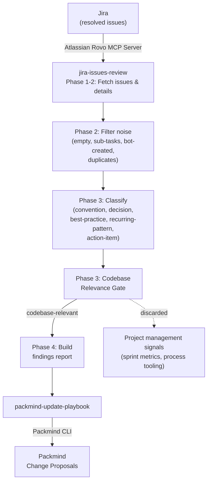

# Update Playbook from Jira Issues

Mine recently resolved Jira issues for conventions, architectural decisions, best practices, and recurring patterns, then automatically create Packmind change proposals. Includes a codebase relevance gate that filters out project management signals (sprint metrics, Jira column moves, etc.) to keep findings focused on what matters for code.

Supports both interactive usage via any AI coding agent with MCP support (Claude Code, GitHub Copilot, Cursor, etc.) and automated CI runs via `CI=true` or `--non-interactive`.

## How It Works



## Skills

| Skill | Description |
|-------|-------------|
| `jira-issues-review` | Fetches resolved Jira issues via Atlassian MCP, filters noise, classifies by playbook relevance, applies a codebase relevance gate, and produces a structured findings report |
| `packmind-update-playbook` | Reads the findings report and creates/updates Packmind playbook artifacts (standards, commands, skills) |
| `packmind-cli-list-commands` | Reference for Packmind CLI listing commands — used to discover existing artifacts before creating duplicates |

## Setup

### 1. Install Packmind CLI

```bash
npm install -g @packmind/cli
```

### 2. Configure Atlassian Rovo MCP Server

Add the [Atlassian Rovo MCP server](https://developer.atlassian.com/cloud/mcp/) to your AI coding agent's MCP configuration. The Rovo MCP server provides Jira tools prefixed with `mcp__atlassian__` (e.g., `searchJiraIssuesUsingJql`, `getJiraIssue`). See the [Getting Started with the Atlassian Remote MCP Server](https://support.atlassian.com/atlassian-rovo-mcp-server/docs/getting-started-with-the-atlassian-remote-mcp-server/) guide for full setup instructions and authentication details.

### 3. Deploy Skills

Copy the skills from this demo into your target repository:

```bash
cp -r update-from-jira/skills/jira-issues-review <your-repo>/.claude/skills/
cp -r update-from-jira/skills/packmind-update-playbook <your-repo>/.claude/skills/
cp -r update-from-jira/skills/packmind-cli-list-commands <your-repo>/.claude/skills/
```

### 4. Authentication

| Secret / Variable | Where | Purpose |
|-------------------|-------|---------|
| `PACKMIND_API_KEY_V3` | Environment variable | Packmind API authentication |
| Atlassian Rovo auth | MCP server config | Atlassian MCP server access (see [Atlassian MCP docs](https://support.atlassian.com/atlassian-rovo-mcp-server/docs/getting-started-with-the-atlassian-remote-mcp-server/)) |
| `ANTHROPIC_API_KEY` | CI environment | Claude API access (CI only) |

## Interactive Usage

Start your AI coding agent in the repository and invoke the skill. Example with Claude Code:

```
claude
> /jira-issues-review
```

The skill will prompt you for:
- **Project**: which Jira project to analyze (or all projects)
- **Time period**: how far back to look (default: 7 days, max: 90 days)

After analysis, findings are saved to `.claude/tmp/jira-review-findings.md` and you're asked whether to proceed with playbook updates.

## Codebase Relevance Gate

Unlike GitHub PR comments, Jira issues often contain signals that aren't relevant to code — sprint metrics, process tooling decisions, team rituals, etc. The `jira-issues-review` skill applies a **codebase relevance gate** after classification:

> **Litmus test**: "Would an AI coding agent need to know this when writing, reviewing, or shipping code in this repository?"

| Signal | Verdict | Why |
|--------|---------|-----|
| "All API endpoints must validate with Zod" | KEEP | Coding convention |
| "Decided event sourcing for orders" | KEEP | Architecture decision |
| "Always add migration scripts" | KEEP | Dev workflow |
| "Run integration tests before merge" | KEEP | Affects how agent ships code |
| "Sprint velocity was 42 points" | DISCARD | Project metrics |
| "Move ticket to QA column after dev" | DISCARD | Process tooling |
| "Use Jira instead of Linear" | DISCARD | Project management tooling |
| "Retro action: more pair programming" | DISCARD | Team ritual |

Discarded signals are listed in a transparency section at the end of the findings report.

## Output

| Mode | Report path |
|------|-------------|
| Interactive | `.claude/tmp/jira-review-findings.md` |
| CI | `.claude/reports/jira-review-findings-YYYY-MM-DD.md` |

## Links

- [Packmind](https://github.com/PackmindHub/packmind/)
- [Packmind Documentation](https://docs.packmind.com)
- [Packmind CLI Setup](https://docs.packmind.com/getting-started/gs-cli-setup)
- [Atlassian Rovo MCP Server](https://support.atlassian.com/atlassian-rovo-mcp-server/docs/getting-started-with-the-atlassian-remote-mcp-server/)
