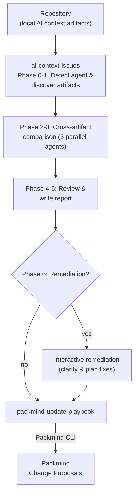

# Update Playbook from AI Context Issues

Audit your AI agent context artifacts (instructions, commands, skills) for contradictions, duplications, and coverage gaps, then automatically create Packmind change proposals from the findings. Works entirely on local files — no MCP server required.

Supports **Claude Code**, **GitHub Copilot**, and **Cursor** agent artifacts.

Interactive usage only.

## How It Works



## Skills

| Skill | Description |
|-------|-------------|
| `ai-context-issues` | Discovers AI agent artifacts, runs structural checks and cross-artifact comparisons, produces a findings report with optional remediation |
| `packmind-update-playbook` | Reads the findings report and creates/updates Packmind playbook artifacts (standards, commands, skills) |
| `packmind-cli-list-commands` | Reference for Packmind CLI listing commands — used to discover existing artifacts before creating duplicates |

## Setup

### 1. Install Packmind CLI

```bash
npm install -g @packmind/cli
```

### 2. Deploy Skills

Copy the skills from this demo into your target repository:

```bash
cp -r update-from-local-context-issues/skills/ai-context-issues/ <your-repo>/.claude/skills/ai-context-issues/
cp -r skills/packmind-update-playbook/ <your-repo>/.claude/skills/packmind-update-playbook/
cp -r skills/packmind-cli-list-commands/ <your-repo>/.claude/skills/packmind-cli-list-commands/
```

### 3. Authentication

| Secret / Variable | Where | Purpose |
|-------------------|-------|---------|
| `PACKMIND_API_KEY_V3` | Environment variable | Packmind API authentication |

No MCP server is required — this use case works entirely on local repository files.

## Usage

Start your AI coding agent in the repository and invoke the skill. Example with Claude Code:

```
claude
> /ai-context-issues
```

The skill will:
1. Detect which agent's artifacts to audit (Claude Code / GitHub Copilot / Cursor)
2. Scan and compare all artifacts for contradictions, duplications, and gaps
3. Produce `ai-context-issues-report.md` at the project root
4. Offer optional remediation (interactive fix planning)
5. Offer to update the Packmind playbook with the findings

## Output

| Mode | Report path |
|------|-------------|
| Interactive | `ai-context-issues-report.md` at project root |

## Links

- [Packmind](https://github.com/PackmindHub/packmind/)
- [Packmind Documentation](https://docs.packmind.com)
- [Packmind CLI Setup](https://docs.packmind.com/getting-started/gs-cli-setup)
