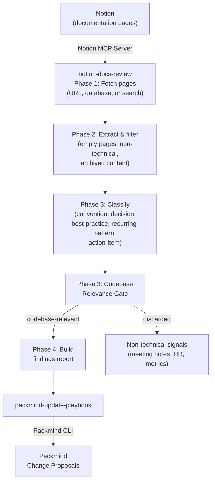

# Update Playbook from Notion Documentation

Browse Notion documentation for coding conventions, architectural decisions, best practices, and technical knowledge, then automatically create Packmind change proposals. Includes a codebase relevance gate that filters out non-technical content (meeting notes, HR policies, project metrics, etc.) to keep findings focused on what matters for code.

Supports both interactive usage via any AI coding agent with MCP support (Claude Code, GitHub Copilot, Cursor, etc.) and automated CI runs via `CI=true` or `--non-interactive`.

## How It Works



## Skills

| Skill | Description |
|-------|-------------|
| `notion-docs-review` | Browses Notion pages via Notion MCP, filters noise, classifies by playbook relevance, applies a codebase relevance gate, and produces a structured findings report |
| `packmind-update-playbook` | Reads the findings report and creates/updates Packmind playbook artifacts (standards, commands, skills) |
| `packmind-cli-list-commands` | Reference for Packmind CLI listing commands — used to discover existing artifacts before creating duplicates |

## Setup

### 1. Install Packmind CLI

```bash
npm install -g @packmind/cli
```

### 2. Configure Notion MCP Server

Add the [Notion MCP server](https://developers.notion.com/guides/mcp/get-started-with-mcp) to your AI coding agent's MCP configuration. The Notion MCP server is hosted at `https://mcp.notion.com/mcp` and uses OAuth for authentication.

**Cursor** — Open Cursor Settings → MCP → Add new global MCP server:

```json
{
  "mcpServers": {
    "notion": {
      "url": "https://mcp.notion.com/mcp"
    }
  }
}
```

**Claude Code** — Run in your terminal:

```bash
claude mcp add --transport http notion https://mcp.notion.com/mcp
```

Then authenticate by running `/mcp` in Claude Code and following the OAuth flow.

**VS Code (GitHub Copilot)** — Create a `.vscode/mcp.json` file:

```json
{
  "servers": {
    "notion": {
      "type": "http",
      "url": "https://mcp.notion.com/mcp"
    }
  }
}
```

### 3. Deploy Skills

Copy the skills from this demo into your target repository:

```bash
cp -r update-from-notion/skills/notion-docs-review <your-repo>/.claude/skills/
cp -r update-from-notion/skills/packmind-update-playbook <your-repo>/.claude/skills/
cp -r update-from-notion/skills/packmind-cli-list-commands <your-repo>/.claude/skills/
```

### 4. Authentication

| Secret / Variable | Where | Purpose |
|-------------------|-------|---------|
| `PACKMIND_API_KEY_V3` | Environment variable | Packmind API authentication |
| Notion OAuth | MCP server config | Notion MCP server access (completed during first tool use via OAuth flow) |
| `ANTHROPIC_API_KEY` | CI environment | Claude API access (CI only) |

## Interactive Usage

Start your AI coding agent in the repository and invoke the skill. Example with Claude Code:

```
claude
> /notion-docs-review
```

The skill will ask how you want to browse Notion:
- **Page URL**: analyze a specific Notion page
- **Database**: browse pages within a Notion database
- **Search keywords**: find relevant pages by topic

After analysis, findings are saved to `.claude/tmp/notion-review-findings.md` and you're asked whether to proceed with playbook updates.

## Non-Interactive Usage

```bash
# Search by query
claude --skill notion-docs-review --non-interactive --query "coding standards"

# Fetch a specific page
claude --skill notion-docs-review --non-interactive --url "https://www.notion.so/workspace/Page-Title-abc123def456"

# Browse a database
claude --skill notion-docs-review --non-interactive --database "https://www.notion.so/workspace/Database-abc123?v=def456"
```

At least one of `--url`, `--database`, or `--query` is required in non-interactive mode. If none are provided, the skill exits gracefully.

## Codebase Relevance Gate

Notion documentation often contains non-technical content alongside coding knowledge. The `notion-docs-review` skill applies a **codebase relevance gate** after classification:

> **Litmus test**: "Would an AI coding agent need to know this when writing, reviewing, or shipping code in this repository?"

| Signal | Verdict | Why |
|--------|---------|-----|
| "All API endpoints must validate input with Zod" | KEEP | Coding convention |
| "Use feature flags for gradual rollouts" | KEEP | Architecture pattern |
| "Error handling: always wrap async calls in try-catch" | KEEP | Best practice |
| "Git branching strategy: trunk-based development" | KEEP | Dev workflow |
| "Team OKRs for Q1 2026" | DISCARD | Business metrics |
| "How to request PTO" | DISCARD | HR process |
| "Notion workspace organization guide" | DISCARD | Tooling documentation |
| "Sprint planning process" | DISCARD | Project management |

Discarded signals are listed in a transparency section at the end of the findings report.

## Output

| Mode | Report path |
|------|-------------|
| Interactive | `.claude/tmp/notion-review-findings.md` |
| CI | `.claude/reports/notion-review-findings-YYYY-MM-DD.md` |

## Links

- [Packmind](https://github.com/PackmindHub/packmind/)
- [Packmind Documentation](https://docs.packmind.com)
- [Packmind CLI Setup](https://docs.packmind.com/getting-started/gs-cli-setup)
- [Notion MCP Server](https://developers.notion.com/guides/mcp/get-started-with-mcp)
- [Notion MCP Supported Tools](https://developers.notion.com/guides/mcp/mcp-supported-tools)
