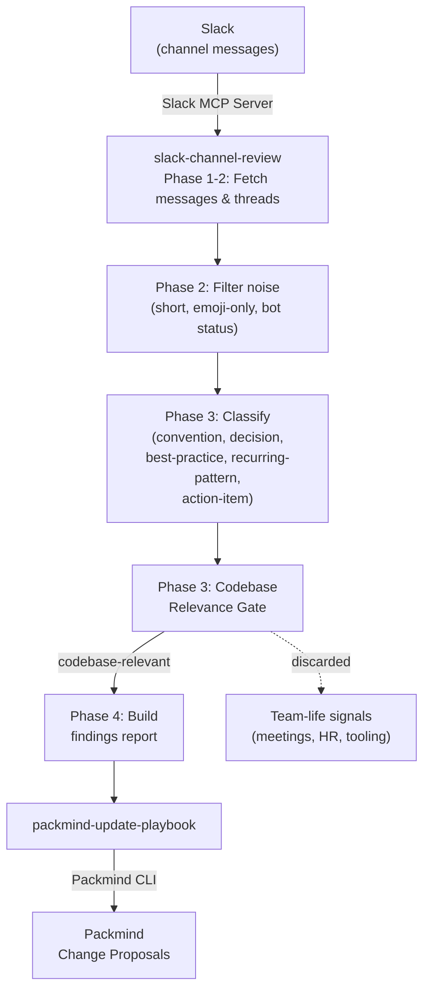

# Update Playbook from Slack Conversations

Mine Slack channel discussions for conventions, architectural decisions, best practices, and recurring patterns, then automatically create Packmind change proposals. Includes a codebase relevance gate that filters out team-life signals (meeting scheduling, HR processes, etc.) to keep findings focused on what matters for code.

Interactive usage only.

## How It Works



## Skills

| Skill | Description |
|-------|-------------|
| `slack-channel-review` | Fetches Slack messages and threads via Slack MCP, filters noise, classifies by playbook relevance, applies a codebase relevance gate, and produces a structured findings report |
| `packmind-update-playbook` | Reads the findings report and creates/updates Packmind playbook artifacts (standards, commands, skills) |
| `packmind-cli-list-commands` | Reference for Packmind CLI listing commands — used to discover existing artifacts before creating duplicates |

## Setup

### 1. Install Packmind CLI

```bash
npm install -g @packmind/cli
```

### 2. Configure Slack MCP Server

The [Slack MCP server](https://docs.slack.dev/ai/slack-mcp-server/) uses **OAuth 2.0** for authentication (not a static Bearer token). Setup depends on your AI coding agent:

- **Claude Code / Cursor / GitHub Copilot** — The Slack MCP server is available as a built-in integration. Connect it directly from your agent's MCP settings; the OAuth flow is handled automatically.
- **Custom MCP client** — Register a Slack app (directory-published or internal), then implement the OAuth 2.0 flow using your app's `client_id` and `client_secret`. The MCP endpoint is `https://mcp.slack.com/mcp`. See the [Slack MCP server documentation](https://docs.slack.dev/ai/slack-mcp-server/) for full details on OAuth endpoints and required scopes.

### 3. Deploy Skills

Copy the skills from this demo into your target repository:

```bash
cp -r update-from-slack/skills/slack-channel-review <your-repo>/.claude/skills/
cp -r update-from-slack/skills/packmind-update-playbook <your-repo>/.claude/skills/
cp -r update-from-slack/skills/packmind-cli-list-commands <your-repo>/.claude/skills/
```

### 4. Authentication

| Secret / Variable | Where | Purpose |
|-------------------|-------|---------|
| `PACKMIND_API_KEY_V3` | Environment variable | Packmind API authentication |
| Slack OAuth | MCP client OAuth flow | Slack MCP server access (see [Slack MCP docs](https://docs.slack.dev/ai/slack-mcp-server/)) |

## Usage

Start your AI coding agent in the repository and invoke the skill. Example with Claude Code:

```
claude
> /slack-channel-review
```

The skill will prompt you for:
- **Channels**: which Slack channels to analyze (default: `general`)
- **Time period**: how far back to look (default: 7 days, max: 30 days)

After analysis, findings are saved to `.claude/tmp/slack-review-findings.md` and you're asked whether to proceed with playbook updates.

## Codebase Relevance Gate

Unlike the GitHub PR use case, Slack conversations often contain signals that aren't relevant to code — meeting scheduling, HR processes, project management tooling, etc. The `slack-channel-review` skill applies a **codebase relevance gate** after classification:

> **Litmus test**: "Would an AI coding agent need to know this when writing, reviewing, or shipping code in this repository?"

| Signal | Verdict | Why |
|--------|---------|-----|
| "Always name hooks `useXxx`" | KEEP | Coding convention |
| "Going with Option B for auth" | KEEP | Architecture decision |
| "Run `nx test` before pushing" | KEEP | Dev workflow |
| "Standup at 10am" | DISCARD | Meeting scheduling |
| "Retros bi-weekly" | DISCARD | Team ritual |
| "Vacation via BambooHR" | DISCARD | HR process |

Discarded signals are listed in a transparency section at the end of the findings report.

## Output

| Mode | Report path |
|------|-------------|
| Interactive | `.claude/tmp/slack-review-findings.md` |

## Links

- [Packmind](https://github.com/PackmindHub/packmind/)
- [Packmind Documentation](https://docs.packmind.com)
- [Packmind CLI Setup](https://docs.packmind.com/getting-started/gs-cli-setup)
- [Slack MCP Server](https://docs.slack.dev/ai/slack-mcp-server/)
