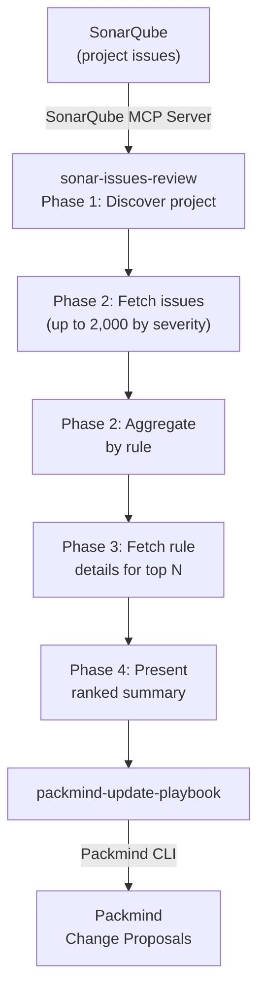

# Update Playbook from SonarQube Issues

Mine SonarQube issues to identify the most violated coding rules, classify them for playbook relevance, and automatically create Packmind change proposals. Bridges static analysis findings with team coding standards by converting recurring SonarQube violations into actionable conventions.

Interactive usage only.

## How It Works



## Skills

| Skill | Description |
|-------|-------------|
| `sonar-issues-review` | Discovers the SonarQube project, fetches open issues by severity, aggregates by rule, retrieves rule details, and produces a ranked summary report |
| `packmind-update-playbook` | Reads the findings report and creates/updates Packmind playbook artifacts (standards, commands, skills) |
| `packmind-cli-list-commands` | Reference for Packmind CLI listing commands — used to discover existing artifacts before creating duplicates |

## Setup

### 1. Install Packmind CLI

```bash
npm install -g @packmind/cli
```

### 2. Configure SonarQube MCP Server

The SonarQube MCP server provides access to your SonarQube instance. Setup depends on your AI coding agent:

- **Claude Code** — Add the SonarQube MCP server to your project's `.claude/settings.json` or user settings. See the [SonarQube MCP Server documentation](https://docs.sonarsource.com/sonarqube-mcp-server/using) for configuration details.
- **Other MCP clients** — Configure the `user-sonarqube` MCP server endpoint following your client's MCP setup instructions.

### 3. Deploy Skills

Copy the skills from this demo into your target repository:

```bash
cp -r update-from-sonar-issues/skills/sonar-issues-review <your-repo>/.claude/skills/
cp -r update-from-sonar-issues/skills/packmind-update-playbook <your-repo>/.claude/skills/
cp -r update-from-sonar-issues/skills/packmind-cli-list-commands <your-repo>/.claude/skills/
```

### 4. Authentication

| Secret / Variable | Where | Purpose |
|-------------------|-------|---------|
| `PACKMIND_API_KEY_V3` | Environment variable | Packmind API authentication |
| SonarQube token | MCP server configuration | SonarQube MCP server access (see [SonarQube MCP docs](https://docs.sonarsource.com/sonarqube-mcp-server/using)) |

## Usage

Start your AI coding agent in the repository and invoke the skill. Example with Claude Code:

```
claude
> /sonar-issues-review
```

The skill will prompt you for:
- **Minimum severity**: which severity threshold to use for filtering issues (default: `MINOR`)
- **Top rules count**: how many of the most violated rules to analyze (default: 30)

After analysis, a ranked summary of violated rules is presented and you're asked whether to proceed with playbook updates.

## Output

| Mode | Report path |
|------|-------------|
| Interactive | Displayed inline — ranked summary table with collapsible rule details |

## Links

- [Packmind](https://github.com/PackmindHub/packmind/)
- [Packmind Documentation](https://docs.packmind.com)
- [Packmind CLI Setup](https://docs.packmind.com/getting-started/gs-cli-setup)
- [SonarQube MCP Server](https://docs.sonarsource.com/sonarqube-mcp-server/using)
